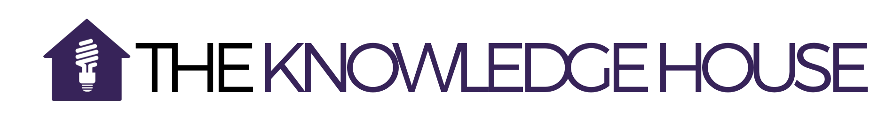

<<<<<<< HEAD

# Innovation Fellowship: Data Science Track Coursework

The Knowledge House (TKH) is a social change organization that educates, empowers, and mentors low-income New York City residents, providing them with the skills needed to launch a successful career in the tech industry. 

This repo contains all of my coursework (lessons, homeworks, labs, and projects) from TKH's 2020 Innovation Fellowship (Data Science Track).
- All lessons are contained within Jupyter Notebooks. 

## Course Description
**Technical Instructor:** Anil Seoparson, aseoparson@theknowledgehouse.org

**Teaching Assistant:** Malcom Holiday, mholliday@theknowledgehouse.org

---

This course is broken into 3 different phases:
| Phase | Description                                      | Status               |             
|:-----:|:------------------------------------------------:|:--------------------:| 
| 1     | Programming Fundamentals & Working with Web Data | :white_check_mark:   |  
| 2     | Data Analysis & Statistical Analysis             | :black_square_button:| 
| 3     | Regression Analysis & Data Visualization         | :black_square_button:|  


Full syllabus can be found [here](https://docs.google.com/document/d/1BDLSvDskE6shlJar5SjAANIYNRq_vJa0iYEuOMi0mI8/edit).

## Installation

```
git clone https://github.com/ishraqkhan32/I2020_DS.git
cd ./I2020_DS
```

## Python Environment & Depenedencies

```
# create virtual environment
python3 -m venv env

# activate environment
source env/bin/activate

# install packages
pip install -r requirements.txt

# deactivate environemnt
deactivate

```

## Meta

Ishraq Khan – Contact me @ [LinkedIn](https://www.linkedin.com/in/ishraq-khan/)

Please comply with academic standards of honesty and pass off any work for homeworks, projects, or labs as your own. I am more than happy to explain if you need any help understanding any of my coursework. 

Distributed under the GPL license. See ``LICENSE`` for more information.
=======
# Python Data Analysis

## __Phase 2__ _(dates are tentative)_

__HWs are due the following Monday, Tuesday and Wednesday. No late submissions or resubmissions allowed__  
__Labs are due the Sunday after given. Resubmissions allowed.__  
__Projects are due by the date listed. Resubmissions allowed__  

### Week 14 - Statistical Analysis
__Assignments: HW-1 and Project-1 (due 01/13)__  
Class 1 - Intro to data science and statistical analysis __[01/04]__  
Class 2 - Statistical libraries: Numpy and Scipy __[01/05]__  
Class 3 - Lab __[01/06]__  

### Week 15 - Data Analysis I - 
__Assignments: HW-2 and Project-2 (due 01/20)__   
Class 1 - Data analysis and cleanup w/ pandas __[01/11]__  
Class 2 - Continuation of previous day __[01/12]__  
Class 3 - Lab __[01/13]__  

### Week 16 - Data Analysis II
__Assignments: HW-3 and Project-3a (due 01/27)__  
Class 1 - Data analysis techniques __[01/18]__  
Class 2 - Data visualizations __[01/19]__   
Class 3 - Lab __[01/20]__   

### Week 17- Data Analysis III
__Assignments: HW-3 and Project-3 (due 02/03)__  
Class 1 - Working with dirty data __[01/25]__   
Class 2 - Data Structuring and clean up __[01/26]__   
Class 3 - Lab __[1/27]__  

### Week 18 - Data Visual
__Assignments: HW-4 and Project-3b (due 02/10)__  
Class 1 - Data visualization continued __[02/01]__  
Class 2 - Feeding charts through JSON  __[02/02]__   
Class 3 - Lab __[02/03]__ 

### Week 19 - Regression Analysis I   
__Assignments: HW-5 and Project-5 (due 02/24)__  
Class 1 - Linear regressions __[02/08]__  
Class 2 - Continuation of previous day __[02/09]__   
Class 3 - Lab __[02/10]__  

### Week 20 - Regression Analysis II  
__Assignments: HW-6__  
Class 1 - Clustering and logarithmic regression  __[02/15]__  
Class 2 - Intro to neural networks __[02/16]__  
Class 3 - Lab __[02/17]__  

### Week 21 - Machine Learning I  
__Assignments: HW-7 and Project-6 (due 03/10)__  
Class 1 - Machine Learning Fundamentals __[2/22]__   
Class 2 - Working with regression data for predictive analysis __[2/23]__  
Class 3 - Lab __[2/24]__  

### Week 22 - Machine Learning II 
__Assignments: HW-8 and Project 7 (Final Project)__  
Class 1 - Creating test cases and testing parameters __[3/1]__    
Class 2 - Continuation of previous day __[3/2]__    
Class 3 - Lab __[3/3]__    

### Week 23 - Natural Language Processing 
__Assignments: HW-9 (Take Home Practice Assessment)__  
Class 1 - Introduction to NLP __[3/8]__   
Class 2 - NLP for data analysis __[3/9]__  
Class 3 - Lab __[3/10]__  

### Week 24 - Assessment Week  
Class 1 - Review __[3/15]__  
Class 2 - Technical Assessment 2 __[3/16]__  
Class 3 - Project Development (and make-up day) __[3/17]__  

### Week 25 - Project Week  
Class 1 - Project development __[3/22]__  
Class 2 - Project development and practice presentations __[3/23]__    
Class 3 - Project presentations __[3/24]__    
>>>>>>> d34d823f6d2dcb91213fa448ff072d8062bfae31
